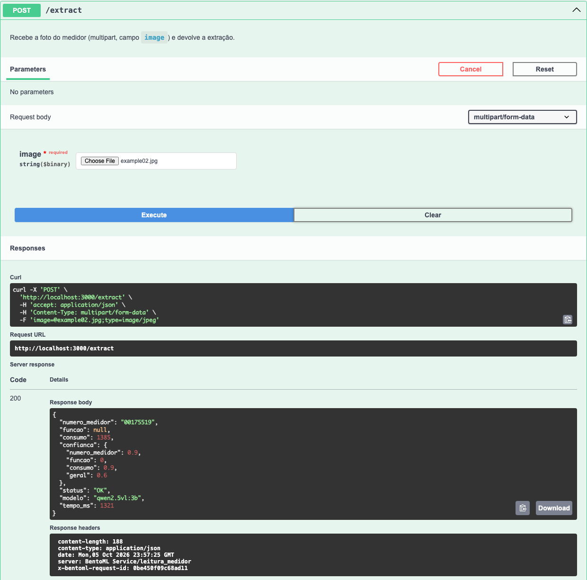

# Extração de leitura de medidor de energia

Serviço de inferência (BentoML) que recebe a foto de uma leitura de medidor de energia
e devolve número do medidor, função (registrador exibido no display), consumo e grau de
confiança. O objetivo é apoiar a triagem das fotos de leitura que hoje passam por
conferência manual na distribuidora.

```
foto ──► POST /extract ──► checagem de nitidez ──► qwen2.5vl:3b (Ollama, local) ──► validação + confiança ──► JSON
```

## Modelo

| Item | Valor |
|---|---|
| Modelo | **Qwen2.5-VL-3B-Instruct**, servido pelo Ollama como `qwen2.5vl:3b` (quantização Q4_K_M, 3,8 B parâmetros, 3,2 GB) |
| De onde vem | Biblioteca do Ollama (`ollama pull qwen2.5vl:3b`); original em https://huggingface.co/Qwen/Qwen2.5-VL-3B-Instruct |
| Quem treinou | Equipe Qwen, da Alibaba Cloud (lançado em janeiro de 2025) |
| Para quê | Modelo de visão e linguagem de uso geral: descrever imagens, ler texto em fotos (OCR), extrair dados estruturados de documentos. **Não foi treinado para medidores de energia**; aqui é usado sem nenhum ajuste (zero-shot), só com um prompt e um JSON schema que força o formato da saída. |
| Licença | **Qwen Research License**: uso permitido apenas para pesquisa e avaliação, não comercial. Atenção: o Ollama exibe Apache 2.0 em `ollama show`, mas o repositório original declara `qwen-research`. Para uso em produção na distribuidora seria preciso pedir licença comercial à Alibaba ou trocar para o `qwen2.5vl:7b`, que é Apache 2.0 (basta `OLLAMA_MODEL=qwen2.5vl:7b`). |

Por que esse modelo: a escolha foi entre (A) OCR clássico + regras, (B) modelo visual local
via Ollama e (C) modelo visual por API externa. Ficamos com B porque roda sem internet
no dia da apresentação, não exige chave de API e não envia fotos para terceiros.
O OCR clássico (A) já tinha sido retirado do MVP por causa da baixa resolução das fotos.
O script `scripts/probe_model.py` foi o teste rápido usado para essa decisão.

## Limitações

**O que o serviço faz:** recebe uma foto, devolve os três campos com uma confiança por
campo e marca como `ILEGIVEL` fotos sem display legível.

**O que ele não faz, frente ao escopo do projeto:**

- **Não verifica a coerência entre a foto e a nota de ocorrência** do leiturista; só lê
  a foto.
- **Não foi validado em base rotulada.** As fotos reais do cliente não têm rótulo, e
  nenhuma delas está no repositório. Não há métrica de acurácia; os resultados abaixo
  são de 5 imagens públicas, conferidas a olho.
- **É sensível a baixa resolução e desfoque.** As fotos reais são 360×480 px e muitas
  estão desfocadas. Foi esse mesmo problema que fez a equipe tirar o OCR do display do
  MVP numa etapa anterior. Trocar o OCR por um modelo visual não resolve a física da
  imagem: com poucos pixels no display, qualquer modelo erra ou inventa.
- **A confiança é heurística**, não uma probabilidade calibrada. O modelo declarou 0,9
  até em campos errados (ver tabela abaixo); por isso ela é combinada com regras de
  formato, mas continua sendo um indicador grosseiro.
- **A função quase nunca é lida.** Nas 5 fotos de exemplo veio sempre `null`, inclusive
  onde ela aparece no display (example01, example02). Os dígitos da função são pequenos
  demais para o modelo 3B.
- **O limiar de nitidez (300) foi calibrado só nas imagens de exemplo.** Nas fotos reais
  ele pode marcar como `ILEGIVEL` fotos que um humano ainda conseguiria ler, ou deixar
  passar fotos ruins.
- **Tempo:** 1,5 a 5 s por foto num Mac com Apple Silicon; a primeira chamada depois de
  subir o Ollama leva cerca de 20 s, porque carrega o modelo na memória.

**Casos de sucesso e de falha nas fotos de exemplo** (valores reais lidos a olho na foto):

| Foto | O que a foto mostra | Resposta do serviço | Resultado |
|---|---|---|---|
| `example01.jpg` | Digital, série 0000193762, função 003, leitura 00050 | série `000050`, função `null`, consumo `null` | ❌ pôs a leitura no lugar da série |
| `example02.jpg` | Digital 480×360, ID 00175519, leitura 001385 | série `00175519`, consumo `1385` | ✅ série e consumo certos; função não lida |
| `example03.png` | Digital com reflexo e desfoque, etiqueta aparentemente 0000307041, leitura 033628 | série `0002307041`, consumo `null` | ⚠️ série provavelmente com 1 dígito errado; consumo não lido |
| `example04.jpg` | Ciclométrico (sem função), série 4788591, leitura 28256 | série `4788591`, função `null`, consumo `28256` | ✅ tudo certo |
| `example05.jpg` | Ciclométrico 265×159, série ilegível, leitura 39513 | série `39513`, consumo `3.95` | ❌ resolução muito baixa: trocou os campos |
| imagem lisa ou desfocada | sem display legível | todos `null`, `status: ILEGIVEL` | ✅ (barrada pela checagem de nitidez) |

**Propostas de melhoria:**

1. Rotular uma amostra das fotos reais (algumas centenas) para medir acurácia por campo
   e calibrar o limiar de nitidez e a fórmula de confiança.
2. Testar o `qwen2.5vl:7b`: resolve a licença e tende a ler melhor, ao custo de mais
   tempo e memória.
3. Recortar o display antes de mandar ao modelo, para usar melhor os poucos pixels.
4. Melhorar a captura na origem: orientar o leiturista ou exigir resolução maior no app.
   Nenhum modelo recupera um display que não está na foto.

### Imagens de exemplo: origem e justificativa

As 5 imagens em `examples/` são fotos públicas de medidores, obtidas na internet:

| Arquivo | Nome original | Tipo de medidor | Resolução | Fonte |
|---|---|---|---|---|
| `example01.jpg` | `relogio-eletronico.jpg` | digital (LCD) | 461×460 | fonte não registrada |
| `example02.jpg` | `hqdefault.jpg` | digital (LCD) | 480×360 | fonte não registrada |
| `example03.png` | `image-1617.png` | digital, com reflexo e desfoque | 469×405 | fonte não registrada |
| `example04.jpg` | `relogio-ciclometrico.jpg` | ciclométrico | 462×462 | fonte não registrada |
| `example05.jpg` | `medidor_de_luz_21_crop.jpg` | ciclométrico, baixa resolução | 265×159 | fonte não registrada |

**Isso foge da orientação do professor**, que pediu imagens sintéticas ou fotos do nosso
próprio medidor. A escolha foi consciente: uma foto do próprio medidor mostraria um único
tipo de display, em boas condições. Selecionamos imagens públicas que cobrem tipos
diferentes (digital, ciclométrico, digital com reflexo e uma de resolução muito baixa)
para mostrar onde o modelo acerta e onde falha, que é o que a seção de Limitações precisa
evidenciar.

**Nenhuma dessas imagens é dado do cliente.** As fotos reais da distribuidora não estão
neste repositório, nem em nenhum commit.

**Uso educacional.** As imagens são usadas apenas para fins educacionais, nesta
disciplina. Os direitos pertencem aos autores originais. Qualquer imagem será removida a
pedido do autor ou do detentor dos direitos.

## Como subir

**Pré-requisitos**

| Ferramenta | Versão testada | Observação |
|---|---|---|
| macOS ou Linux | macOS 27 (Apple Silicon) | |
| git | qualquer recente | |
| [uv](https://docs.astral.sh/uv/getting-started/installation/) | 0.11.8 | baixa sozinho o Python 3.12.13 e o `just` |
| [Ollama](https://ollama.com/download) | 0.12.3 | |
| Disco | ~4 GB livres | 3,2 GB do modelo + ~100 MB do ambiente Python |
| RAM | 8 GB ou mais | |

Não é preciso instalar Python nem `just` à parte: o `uv` instala a versão fixada em
`.python-version` e o `just` vem como dependência de desenvolvimento (`rust-just`).

**Do clone até a primeira predição** (com internet, só na primeira vez). São três
terminais, porque o Ollama e o serviço ficam rodando:

```bash
# Terminal 1: Ollama (ou abra o app do Ollama, que já sobe o servidor)
ollama serve
```

```bash
# Terminal 2: instalação e serviço
git clone https://github.com/henriquebouwman/ml-ops-av1.git
cd ml-ops-av1
uv run just setup     # até ~1 min: Python 3.12.13 + dependências exatas do uv.lock (~85 MB)
uv run just model     # ~2 a 10 min, conforme a rede: download de 3,2 GB
uv run just serve     # sobe em poucos segundos e fica rodando
```

```bash
# Terminal 3: primeira predição
cd ml-ops-av1
uv run just demo      # ~20 s na primeira chamada (carrega o modelo), depois 1,5 a 5 s
```

Para conferir se está de pé: `curl -i http://localhost:3000/healthz` responde 200 quando
o serviço está no ar; `curl -i http://localhost:3000/readyz` só responde 200 quando o
Ollama também está de pé com o modelo baixado.

**Configuração (opcional).** Sem nada configurado, o serviço usa o Ollama em
`http://localhost:11434` e o modelo `qwen2.5vl:3b`. Para mudar, copie `.env.example` para
`.env` e preencha `OLLAMA_URL` e/ou `OLLAMA_MODEL`; o `just` carrega o `.env`. Não há
segredos neste projeto.

**Rodando offline (no dia).** Depois de `just setup` e `just model` feitos com internet,
nada mais é baixado: o ambiente fica em `.venv/` e o modelo em `~/.ollama/models`.
O serviço não faz download em tempo de execução. Sem rede:

```bash
ollama serve                      # terminal 1
UV_OFFLINE=1 uv run just serve    # terminal 2
UV_OFFLINE=1 uv run just demo     # terminal 3
```

`UV_OFFLINE=1` impede o `uv` de tentar consultar a internet.

**Windows.** O fluxo acima foi testado em macOS; em Linux os comandos são os mesmos.
Não foi testado no Windows. No Windows, a recomendação é usar WSL2 e seguir os mesmos
comandos. Sem WSL, o `justfile` pode não
funcionar; os comandos equivalentes, no PowerShell, são:

```powershell
uv sync --frozen
ollama pull qwen2.5vl:3b
uv run bentoml serve service:LeituraMedidor --port 3000
curl.exe -s -F "image=@examples/example02.jpg" http://localhost:3000/extract
```

## Uso

**Endpoint:** `POST /extract`, `multipart/form-data` com o campo `image` (JPEG, PNG ou WebP).

**Swagger:** http://localhost:3000 (com o serviço no ar), onde dá para enviar uma foto
pelo navegador. Abaixo, uma chamada real com `example02.jpg` feita pelo Swagger
(`docs/swagger.png`):



**Exemplo de entrada e saída:**

```bash
curl -s -F "image=@examples/example02.jpg" http://localhost:3000/extract
```

```json
{
  "numero_medidor": "00175519",
  "funcao": null,
  "consumo": 1385.0,
  "confianca": {"numero_medidor": 0.9, "funcao": 0.0, "consumo": 0.9, "geral": 0.6},
  "status": "OK",
  "modelo": "qwen2.5vl:3b",
  "tempo_ms": 1319
}
```

(arquivo completo em `examples/exemplo_resposta.json`; outras chamadas reais em `docs/curl.txt`)

**Campos da resposta**

| Campo | Tipo | Significado |
|---|---|---|
| `numero_medidor` | string ou null | número de série do medidor |
| `funcao` | string ou null | código do registrador no display; `null` em medidores ciclométricos |
| `consumo` | número ou null | leitura em kWh |
| `confianca` | objeto | confiança de 0 a 1 por campo e `geral` |
| `status` | `OK` ou `ILEGIVEL` | `ILEGIVEL` quando nenhum campo pôde ser lido |
| `modelo` | string | modelo usado, `nome:tag` |
| `tempo_ms` | inteiro | tempo da extração em milissegundos |

**Como a confiança é calculada** (`extractor/confianca.py`):

> A confiança de cada campo é a confiança que o modelo declara multiplicada por 1 se o
> valor passa na regra de formato, por 0,5 se não passa e por 0 se o campo veio nulo; a
> geral é a média dos três campos.

Regras de formato: número do medidor com 5 a 15 dígitos; função com 1 a 3 dígitos;
consumo numérico e não negativo.

**Quando a foto é `ILEGIVEL`:** antes de chamar o modelo, o serviço mede a nitidez da
imagem (variância do filtro de bordas, `extractor/nitidez.py`). Abaixo de 300, a foto é
considerada lisa ou desfocada demais: o modelo nem é chamado e a resposta vem com campos
`null` e `status: "ILEGIVEL"`. Essa checagem existe porque, numa imagem sem display, o
modelo inventava um número (`1234567890`) em vez de devolver `null`. Se a foto passa na
checagem mas o modelo não lê nenhum campo, o status também é `ILEGIVEL`.

**Erros**

| Situação | HTTP | Resposta |
|---|---|---|
| Arquivo não é imagem | 400 | `O campo 'image' não é uma imagem válida. Envie um arquivo JPEG, PNG ou WebP.` |
| Campo `image` ausente | 400 | erro de validação do BentoML (`Field required`) |
| Ollama fora do ar | 503 | corpo genérico do BentoML; no log do servidor: `Modelo indisponível: confira se o Ollama está rodando (ollama serve).` |
| Modelo devolveu JSON fora do formato | 502 | corpo genérico do BentoML; no log do servidor: `O modelo devolveu uma resposta fora do formato esperado.` |

Nos erros 5xx o BentoML não repassa a mensagem ao cliente (por segurança, o corpo é
sempre `An unexpected error has occurred, please check the server log.`); a mensagem
clara fica no terminal do `just serve`. Para diagnosticar, `curl -i
http://localhost:3000/readyz` devolve 503 enquanto o Ollama ou o modelo não estiverem
prontos.

## Testes

```bash
uv run just test
```

Três testes em `tests/test_service.py`, que chamam o app do BentoML em processo (sem
subir servidor):

| Teste | O que verifica | Precisa do Ollama? |
|---|---|---|
| `test_foto_boa_extrai_leitura` | `example02.jpg` → 200, `status: OK`, consumo 1385 | sim; é pulado (`SKIPPED`) com o motivo se o Ollama não estiver de pé |
| `test_foto_ruim_devolve_ilegivel` | `example02.jpg` desfocada → 200, campos `null`, `status: ILEGIVEL`, confiança 0 | não |
| `test_entrada_invalida_devolve_400` | texto enviado como `.jpg` → 400 com mensagem clara | não |

Saída esperada: `3 passed` (ou `2 passed, 1 skipped` sem o Ollama).

Também há `tests/test_confianca_nitidez.py`, com testes unitários da fórmula de confiança
e da checagem de nitidez (7 passam, 1 `xfail`; não precisam de Ollama). O `xfail` documenta
uma limitação conhecida: o `FIND_EDGES` do Pillow não filtra a borda de 1 px, então uma
imagem lisa e não preta (por exemplo, cinza 200x200) passa como nítida. Fotos reais não
são lisas, mas a checagem de nitidez não é à prova disso.

## Uso de IA

**Ferramentas usadas**

- **Claude Cowork** (Anthropic): para montar o roteiro de execução, com as etapas, as
  restrições e os critérios de entrega.
- **Claude Code** (Anthropic, modelo Claude Opus): para executar o roteiro neste
  repositório, rodando os comandos, escrevendo o código e fazendo os commits. A equipe
  foi conferindo cada entrega.

**O que foi pedido à ferramenta, por etapa** (ver `git log`)

| Etapa | O que pedimos | Commits |
|---|---|---|
| Repositório | `.gitignore` antes de tudo, LICENSE MIT, esqueleto do README | `8f24928` |
| Dependências | Python fixado, dependências com versão exata, `uv.lock` | `0b9fa80` |
| Escolha do modelo | um script descartável que rodasse o modelo local nas fotos de exemplo e mostrasse resultado e tempo, parando para a nossa decisão | `fe705e8` |
| Serviço | `POST /extract` em BentoML, com o contrato JSON, erro 4xx para arquivo inválido e `ILEGIVEL` para foto sem display | `178c218` |
| Confiança | combinar a confiança declarada pelo modelo com validações determinísticas, numa fórmula explicável em uma frase | `178c218` |
| Nitidez | checagem antes do modelo, porque numa foto lisa o modelo inventava um número | `178c218` |
| Comando único | `justfile` com setup, model, serve, test e demo | `e789fa8` |
| Testes | 3 testes: foto boa, foto ruim e entrada inválida | `82ffb24` |
| README | seções na ordem das perguntas da apresentação, com limitações honestas | `ac68526` |
| Revisão da entrega | simular um clone limpo seguindo o README e corrigir o que travasse; checklist de nome do cliente, segredos e dados; pendências finais (quebras de linha, imagens, Swagger, Windows, esta seção) | `0ccf5d5` em diante |

**Problemas que apareceram durante a execução** (a maioria apontada pela própria
ferramenta ao testar; registramos aqui porque mudaram o resultado):

- O modelo copiava o valor de exemplo que estava no prompt ("03") como resposta; o
  exemplo foi tirado do prompt.
- Numa imagem lisa, o modelo inventava o número `1234567890` em vez de devolver `null`;
  por isso entrou a checagem de nitidez antes do modelo.
- O Ollama mostra a licença Apache 2.0 para o `qwen2.5vl:3b`, mas o repositório original
  declara uma licença só para pesquisa; corrigimos na seção Modelo.
- O primeiro passo a passo do README travava se seguido num terminal só, e a estimativa
  de tamanho do ambiente estava errada (~1 GB, o real é ~85 MB); os dois apareceram na
  simulação do clone limpo.
- Nós colocamos por engano a pasta com a base do cliente dentro do repositório; a
  ferramenta parou antes de qualquer commit e a pasta foi movida para fora.

**Nossa avaliação crítica**

A ferramenta executou bem o roteiro e não encontramos muitos erros no que ela entregou.
O ponto que precisamos esclarecer durante o trabalho foi o foco: o mais importante era
entregar o fluxo bem feito (serviço, dependências fixadas, testes, README que roda) e
não ter um modelo com boa acurácia. Depois disso, as decisões passaram a priorizar o
serviço em volta do modelo.

- **O que aceitamos sem alterar:** de modo geral, a execução das etapas do roteiro.
- **O que corrigimos ou rejeitamos:**
  - Rejeitamos a licença que o Ollama exibe (Apache 2.0) para o `qwen2.5vl:3b`; o
    repositório original declara uma licença só para pesquisa, e a seção Modelo foi
    corrigida.
  - Tiramos do prompt o valor de exemplo, porque o modelo o copiava como resposta.
  - Não aceitamos que o modelo decida sozinho quando não há display: a checagem de
    nitidez antes do modelo existe porque ele inventava `1234567890` numa imagem lisa.
  - Corrigimos o passo a passo do README depois de simular um clone limpo (travava num
    terminal só, e o tamanho do ambiente estava errado).
- **O que ainda não confiamos:**
  - **O limiar de nitidez (300):** foi calibrado só nas imagens de exemplo. Além disso, o
    `FIND_EDGES` do Pillow não filtra a borda de 1 px, então uma imagem lisa e não preta
    passa como nítida (cinza 200×200 dá variância 319; branca, 1268). Está registrado
    como `xfail` em `tests/test_confianca_nitidez.py`.
  - **A fórmula de confiança:** o modelo declarou 0,9 até em campos errados, e a fórmula
    só corta pela metade quando o formato é inválido. Um número errado com formato válido
    mantém a confiança alta.
  - **O prompt:** foi ajustado a olho em 5 fotos, sem base rotulada, e a função quase
    nunca é lida.
- **Como dividimos a revisão do código:**
  - João Pedro revisou `extractor/confianca.py`, `extractor/nitidez.py` e escreveu os
    testes unitários de ambos (branch `joao/testes-unitarios`, em pull request).
  - _[PENDENTE: Henrique e João confirmarem quem revisou `service.py`,
    `extractor/modelo.py`, `tests/test_service.py` e o README]_

## Estrutura

```
service.py           serviço BentoML: valida a entrada, chama o extrator, traduz erros
extractor/
  modelo.py          prompt, JSON schema, chamada ao Ollama e limpeza dos campos
  nitidez.py         checagem de nitidez antes do modelo
  confianca.py       validações de formato e fórmula da confiança
tests/               3 testes do /extract
examples/            5 fotos públicas + exemplo_resposta.json
docs/                evidências (curl, Swagger) e texto do slide sobre as imagens
scripts/probe_model.py   teste descartável usado para escolher o modelo
justfile             setup, model, serve, test, demo
```

## Licença

Código sob licença MIT. Veja [LICENSE](LICENSE). O modelo tem licença própria (ver
seção Modelo).
